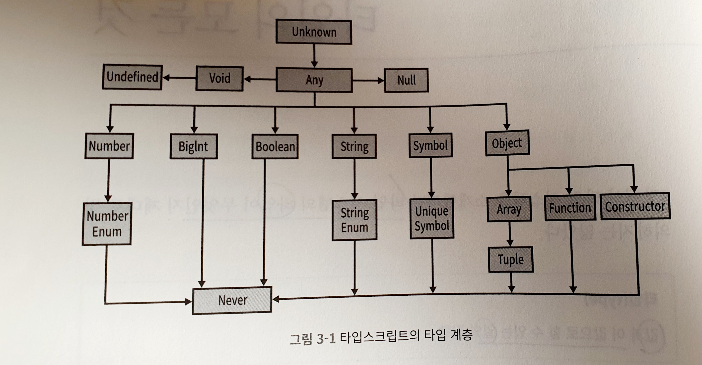

### ch1. 타입스크립트를 써야하는 이유

##### 생산성을 배로 늘려준다.
- 흔히 발생하는 실수방지, 
- 문서화 제공, 
- 리팩토링이 쉬워짐, 
- 단위 테스트의 숫자를 반으로 줄여서 더 **안전한** 프로그램을 만들 수 있음

 "**안전함**"이란?<br/> 
 **`타입 안정성`**: **타입을 이용해 프로그램이 유효하지 않은 작업을 수행하지 않도록 방지**한다.

유효하지 않은 동작의 예:<br/> 
1. 숫자와 리스트 곱하기 
2. 객체 리스트를 인수로 받는 함수에 문자열 리스트를 인수로 전달해 호출
3. 객체에 존재하지 않는 멤버 함수를 호출하기
4. 최근에 다른 곳으로 이동된 모듈 임포트하기

> => 자바스크립트는 이런 유효하지 않은 작업이라도 최대한 실행하려 시도하기 때문에,<br/>
코드에 실수를 저지른 시점과 - 실수를 인지하는 시점에 차이가 생긴다.<br/>

자바스크립트는 브라우저로 프로그램을 실행할 때,<br/> 
그제서야 실수를  인지할 수 있다.<br/>


그래서 타입스크립트가 등장했다!

##### 타입스크립트의 장점 :

 "**`에러를 알려주는 시점`**" (**개발자가 텍스트 편집기에 코드를 입력하는 순간, 곧바로 에러메시지를 발생**시킨다.)


##### 타입스크립트를 사용하면 어떤 점이 달라지나요?

- 모든 타입관련 버그가 사라짐
- 코드 작성방식의 변화 (코드를 짤 때, 타입수준으로 먼저 생각하고, 값 수준으로 생각하게 된다.)


### ch2. 타입스크립트 컴파일러(TSC)의 동작 원리

##### 2.1 컴파일러
- 프로그램 실행과정
1. 프로그램이 AST로 파싱된다. (컴파일러가 소스코드를 파싱해 AST로 만든다.)
2. AST가 바이트코드로 컴파일된다.
3. 런타임이 바이트코드를 평가한다.

타입스크립트는 다른 언어와는 달리<br/>
컴파일러가 코드를 바이트코드 대신 js코드로 변환한다. <br/>이후에는 일반적인 js코드를 실행하듯 브라우저, NodeJS로 실행할 수 있다.<br/>

###### 타입스크립트는 코드를 더 안전하게 만든다고 했는데, 코드는 언제 안전해지지?
-> 타입스크립트 컴파일러는 AST를 만들어 결과 코드를 내놓기 전에 "타입 확인"을 거친다.<br/>

##### 2.2 타입 시스템
- [어노테이션 사용] 어떤 타입을 사용하는지를 컴파일러에 "명시적으로 알려주는" 타입시스템
- [어노테이션 사용 x] "자동으로 타입을 추론하는" 타입시스템

###### 명시적 예시
let a: number = 1   <br/>
###### 추론 예시
let c = [true,false]  // c는 boolean배열 <br/>

타입스크립트가 타입을 추론하도록 두는 것이 코드를 줄이므로, 보통 어노테이션은 생략한다.<br/>

- 타입은 어떻게 결정되는가?<br/>
typescript는 점진적으로 타입을 확인하는 언어이다.<br/>
그래서 컴파일할 때 반드시 모든 타입을 알아야하는 것은 아니다.<br/>
이 특성은 js - >ts로 마이그레이션할 때 유용하다.<br/>
그러나 마이그레이션 상황이 아니라면, 모든 코드의 타입을 컴파일 타임에 지정하는 것을 목표로 하자.<br/>

- 타입 검사 시점<br/>
컴파일 타임에 코드의 타입을 확인한다.<br/>

- 에러 검출 시점<br/>
순수 js는 런타임에 에러가 발생하지만, <br/>Typescript는 컴파일 타임에 검출할 수 있다.

##### 2.3 코드 편집기 설정
- tsconfig.json
ts프로젝트에서 어떤 파일을 컴파일하고, 어떤 js버전으로 방출하는지 등을 정의

- tslint.json
TSLint 설정 (탭을 사용할지 공백을 사용할지 등을 결정하는 코딩 스타일 규약)

##### 2.4 index.ts


### ch3. 타입스크립트에서 사용할 수 있는 타입은? 각각의 타입으로 무엇을 할 수 있을까?

타입 검사기(typechecker)를 이용해 유효하지 않는 동작이 실행되는 일을 예방하자.



##### 타입스크립트 Type의 종류
###### any
- 꼭 필요한 상황이 아니라면 사용하지 않는 것이 좋다.<br />
- any를 사용하면 값이 js처럼 동작하면서, 타입검사기가 작동하지 않는다.

###### unknown
- 타입을 미리 알 수 없는 어떤 값이 있을 때, any대신 unknown을 사용
- 비교연산(==, ===, ||, &&, ?)과 반전(!)을 지원
- js의 typeof, instanceof 연산자로 정제할 수 있다.
- 명시적으로 설정해야만 사용 가능
- unknown 타입이 아닌 값과 unknown 타입인 값을 비교할 수 있다.


###### boolean
- true, false 2개의 값
- 비교 연산(==, ===, ||, &&, ?)과 반전(!) 연산만 가능<br />

예시<br />
let a = true  // boolean<br />
var b = false // boolean<br />
주로 위와 같은 방법으로 사용한다.<br />

예시<br />
let e: true = true   // true<br />
변수 e는 평범한 boolean이 아니라, boolean true라는 특정 타입을 갖고있다.<br />
값을 타입으로 사용하므로, e에 사용할 수 있는 값은 boolean타입이 가질 수 있는 값 중 특정한 하나의 값으로 한정된다. 이 기능을 "타입 리터럴"이라 부른다.<br />

- 타입 리터럴이란?
오직 하나의 값을 나타내는 타입<br />

###### number
- 모든 숫자(정수, 소수, 양수, 음수, Infinity NaN 등)의 집합
- 덧셈(+), 뺄셈(-), %, 비교(<) 등의 숫자 관련 연산
- 명시적으로 지정해도 되고, 추론하게 해도 된다.
- 보통은 타입스크립트가 값이 number임을 추론하게 한다. (let a = 1234)

###### bigint
- 2^53보다 큰 정수를 표현할 수 있다.
- 덧셈, 뺄셈, 곱셈, 나눗셈, 비교 연산
- 가능하면 타입스크립트가 추론하게 만들자.

###### string
- 모든 문자열의 집합
- 연결(+), 슬라이스(.slice) 등의 연산 수행
- 가능하면 타입스크립트가 추론하게 만들자.


###### symbol
- 실무에서는 자주 사용하지 않는 편
- 객체와 맵에서, 문자열 키를 대신하는 용도로 사용
- symbol 타입으로는 할 수 있는 동작이 별로 없다.
```
let a = Symbol('a')   // symbol
let b: symbol = Symbol('b')  // symbol
var c = a === b   // boolean
```
- unique symbol 만드는 법


###### 객체
- ts로 객체를 정의하는 방법은 총 4가지이다. (p34)
- 객체 타입만으로는 {}로 만든 간단한 객체와, new로 만든 복잡한 객체를 구분할 수 없다<br />
```
let a: object = { b: 'x'}
```
여기서 a.b에는 접근할 수 없다.(에러)

- 객체를 만드는 또다른 방법: 객체 리터럴 문법 (타입스크립트가 추론하도록)
```
let a: { b: number } = {
    b: 12
}  // {b: number}
```

- 객체를 const로 선언하느냐/ let으로 선언하느냐에 따른 차이 (p30)

- 확실한 할당

- 인덱스 시그니처<br />
[key: T]: U 같은 문법. ts에 어떤 객체가 여러 키를 가질 수 있다.<br />
인덱스 시그니처의 키(T)는 반드시 number나 string타입에 할당할 수 있는 값이어야한다.

- 객체: Object로 객체 타입을 만드는 방법도 있지만, {}와 비슷한 방법이며, 추천하지 않는다.

###### 타입 별칭, 유니온, 인터섹션
값뿐만 아니라 타입에도 어떤 동작을 수행할 수 있다. 타입수준에서 수행할 수 있는 몇가지 동작<br />

- 타입 별칭 (타입 별칭으로 타입을 가리킬 수 있다.)<br />
변수가 어떤 목적으로 사용됐는지 쉽게 이해할 수 있게 도와준다.<br />
값을 변수로 할당할지를 결정하는 것과 같은 기준으로, 타입 별칭을 사용할지 여부를 결정할 수 있다.<br />

- 유니온과 인터섹션 타입<br />
실무에서는 인터섹션보다 "유니온"을 자주 사용<br />
"유니온"은 이형(heterogeneous) 배열일 때 자주 등장<br />

###### 배열
- 연결, 푸시, 검색, 슬라이스 등을 지원하는 특별한 객체
- 배열에 무엇을 넣을 수 있고, 무엇을 넣을 수 없는지에 대한 규칙이 있다.
- 대부분 동형(homogeneous)으로 배열을 만든다.
- 타입스크립트에서는 T[]와 Array`<T>`라는 2가지 배열 문법 지원 (성능, 의미상 두 표현은 같다.)
<br />

###### 튜플
- 배열의 서브타입
- 길이가 고정되었고, 각 인덱스의 타입이 알려진 배열의 일종
- 다른 타입과 달리, 튜플은 선언할 때 타입을 명시해야한다.
```
// [이름, 성씨, 생년] 튜플
let b: [string, string, number] = ['malcolm', 'gladwell', 1963]
```
<br />

- 읽기 전용 배열과 튜플<br />
ts는 Array처럼 읽기 전용 배열과 튜플을 만드는 긴 형태의 선언 방법을 지원한다.<br />
```
type A = readonly string[]  // readonly string[]
type B = ReadonlyArray <string>  // readonly string[]
type C = Readonly<string[]>  // readonly string[]

type D = readonly [number,string]  // readonly [number,string]
type E = Readonly<[number, string]> // readonly [number,string]
```
<br />


###### null, undefined, void, never
ts에서 undefined 값의 타입은 오직 undefined뿐이고, <br />null 값의 타입은 null뿐이다.<br />
- ts에서는 null과 undefined 이외에도 void와 never 타입도 제공한다.
- void와 never은 존재하지 않음의 특징을 좀 더 세밀하게 분류 (특별한 용도의 타입)
void: 명시적으로 아무것도 반환하지 않는 함수의 반환타입 (예: console.log)<br />
never: 절대 반환하지 않는 (예외를 던지거나 영원히 실행되는) 함수 타입<br />
- null: 값이 없음, undefined: 아직 값을 변수에 할당하지 않음

- 엄격한 null 확인

###### 열거형 (enum)
- 해당 타입으로 사용할 수 있는 값을 열거하는 기법
- 키를 값에 할당하는, 순서가 없는 자료구조
```
enum Language {
    English, Spanish, Russian
}
```

- 열거형을 안전하게 사용하기 힘드므로, 열거형 자체를 사용하지 않는 것을 추천


###### 마무리
- ts가 값의 타입을 추론하거나 / 타입을 명시할 수 있다.
- let과 var를 사용하면 일반적인 타입으로 추론하는 반면,<br />
- const를 사용하면 더 구체적인 타입을 추론하게 만든다.<br />
- 대부분의 타입은 일반 타입 / 구체적인 타입 2가지 제공<br />
구체적 타입은 보통 일반 타입의 서브타입<br />


##### 질문
1. any 타입의 존재 이유와, 사용 예시를 설명해주세요 (p22)
2. 타입 리터럴에 대해 아래 두 줄의 코드를  사용해 설명해주세요. (p24)
``` 
let e: true = true   // true<br /> 
```
``` 
let f: true = false  // 에러: false 타입을 true 타입에 할당할 수 없음 
```
3. string 타입에 대해 아래 두 줄의 코드를 설명해주세요 (p27)
```
let f: 'john' = 'john' // 'john'
let g: 'john' = 'zoe'  // 에러
```

4. symbol 사용 예시와, 사용 이유를 설명해주세요.(p27)<br/>
symbol은 객체와 맵에서 문자열 키를 대신하는 용도로 사용합니다.<br/>
symbol 키를 사용하면 사람들이 잘 알려진 키만 사용하도록 강제할 수 있어서 키를 잘못 설정하는 실수를 방지한다는데, <br/>이 부분이 잘 와닿지 않아서 예시가 궁금합니다.<br/>

5. 타입 리터럴 v.s. 객체 리터럴의 차이를 알려주세요 (p30)

6. 타입스크립트로 객체를 정의하는 총 4가지의 방법을 비교해서 설명해주세요. (p34 코드)

7. "타입 별칭"을 사용할지 여부를 결정하는 기준, 그 예시가 궁금합니다. (p37)

8. 유니온 타입, 인터섹션 타입의 사용 이유가 궁금합니다. (p 37 ~ 39)

9. 배열을 선언할 때 v.s. 튜플을 선언할 때, 타입을 명시하는 방법을 비교해주세요 (p42)

10. `let`과 `var`를 사용하면 일반적인 타입으로 추론하는 반면, `const`를 이용하면 더 구체적인 타입을 추론하게 하는데, 둘의 차이점을 설명해주세요


